# Azure AI Search를 이용한 벡터 검색

Azure AI Search 와 Storage Account를 사용한 벡터 검색 방법을 안내합니다.

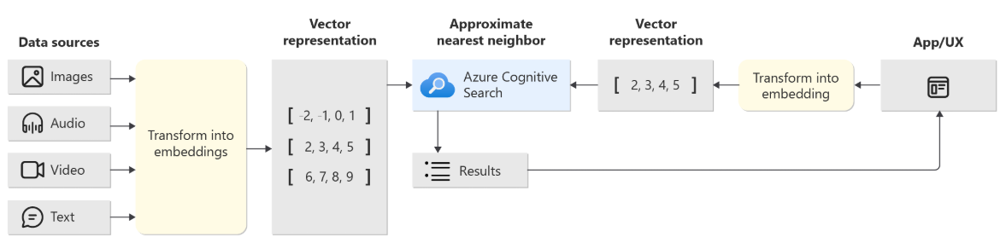

출처: [Azure AI Search의 벡터](https://learn.microsoft.com/ko-kr/azure/search/vector-search-overview)

## 벡터 검색을 위해 필요한 사항
- Azure OpenAI
- 임베딩 모델: [text-embedding-ada-002](https://learn.microsoft.com/ko-kr/azure/ai-services/openai/concepts/models?tabs=python-secure%2Cglobal-standard%2Cstandard-chat-completions#embeddings)
- Azure AI Search
- Azure Blob Storage

---

## 1. 리소스 그룹 생성

[Azure 에 리소스그룹 생성](https://techcommunity.microsoft.com/blog/startupsatmicrosoftblog/step-by-step-guide-creating-an-azure-resource-group-on-azure-portal/3792368)
   
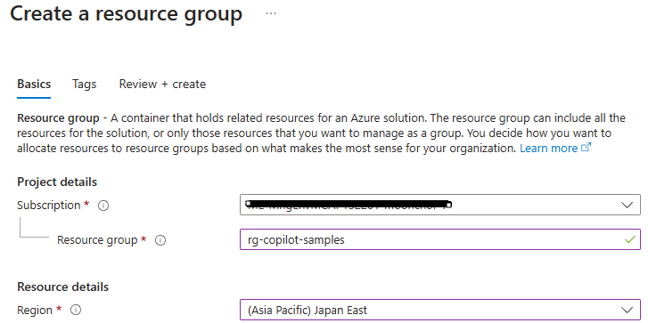

---

## 2. Azure OpenAI 리소스 생성

Azure OpenAI 리소스를 리소스 그룹내에 생성
   


### 2.1 임베딩 모델 배포

- 모델 배포를 위해서 OpenAI 리소스 `개요` 화면에서 `Explorer AI Foundry portal` 버튼을 클릭하여 이동
- AI Foundry 사이트에서 `Deployments` 메뉴로 이동하고 `Deploy model` 을 선택하여 `text-embedding-ada-002` 모델 선택


---

## 3. Storage Account 생성

Storage Account 생성

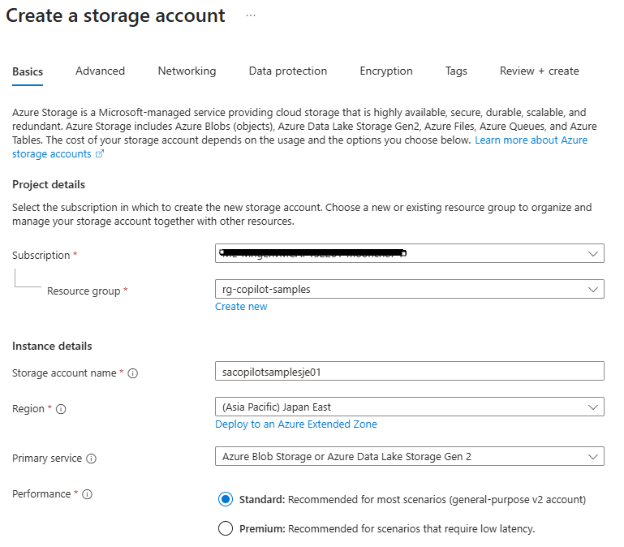

---

## 4. Azure AI Search 생성

Azure AI Search 생성 (구독당 하나의 Free 리소스 생성 가능)

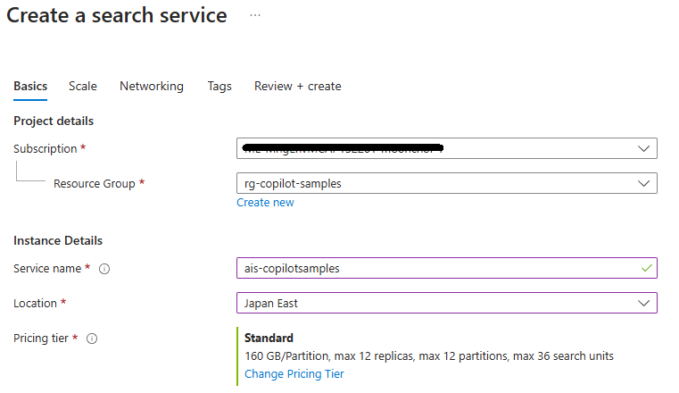

---

## 5. 리소스 확인

리소스 그룹에서 생성된 리소스 목록이 다음처럼 보여지면 준비가 된 상태


---

## 6. 컨테이너 생성 및 파일 업로드

생성된 `저장소 계정`에서 `files`라는 컨테이너 생성후 예제파일([풍력발전_오해와_진실.pdf](../files/풍력발전_오해와_진실.pdf))
- 좋은 검색을 위해서 절적한 [청크](https://learn.microsoft.com/ko-kr/azure/search/vector-search-how-to-chunk-documents)가 필요
- 예제파일은 pdf 뿐만 아니라 docx, pptx 등 가능


---

## 7. AI Search 벡터 데이터 추가

AI Search 에서 벡터 데이터 추가

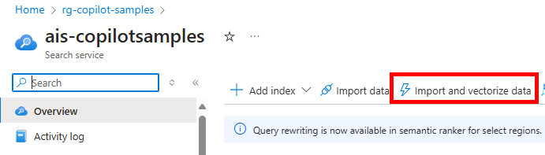

### 7.1 Data Connection 설정

data connection 은 Azure Blob Storage 이고 storage account 를 3단계에서 생성한 이름으로 다음 그림과 같이 설정

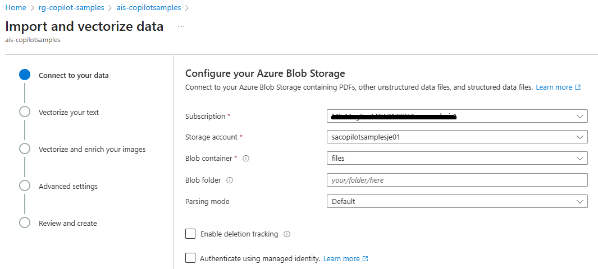

### 7.2 임베딩 모델 선택

임베딩 모델을 선택 (보이지 않으면 2단계에서 모델 배포 필요)


### 7.3 이미지 벡터화 (옵션)

`Vectorize and enrich your images` 단계는 필요시 설정

### 7.4 Review 및 완료

Review 단계 예시


### 7.5 벡터 검색 테스트

완료 후 벡터 검색 테스트 검색어 `소음`


---

## 8. Copilot Studio 에이전트 생성

Copilot Studio 에서 테스트를 위한 에이전트 생성

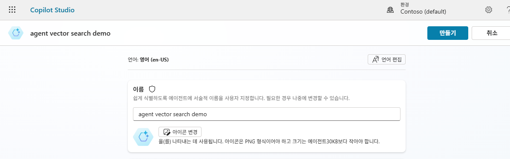

### 8.1 생성형 오케스트레이션 활성화

생성형 오케스트레이션 활성화를 위해 `설정` 에서 `생성형 AI` 에서 Generative(preview) 로 변경

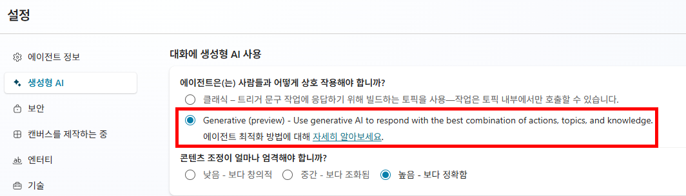

---

## 9. 참조 자료 추가

`참조 자료` 메뉴에서 참조자료 추가 `고급` 선택하여 Azure AI Search 선택
    
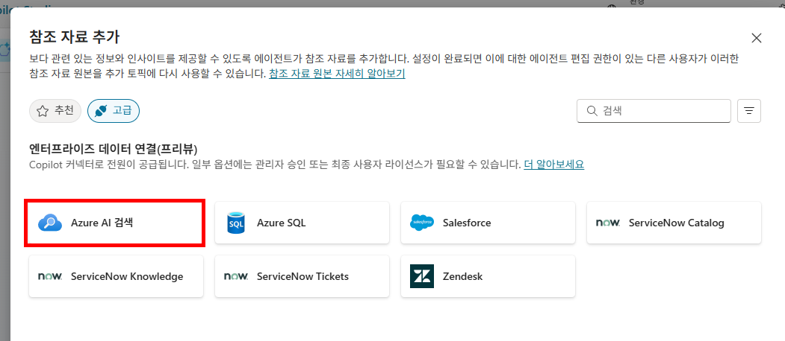
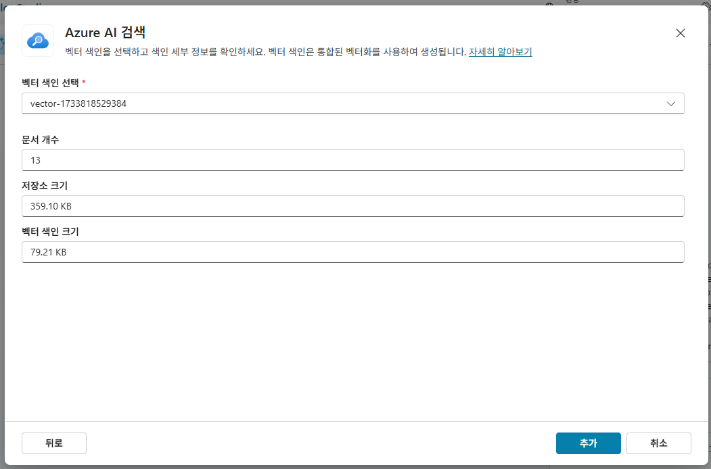

---

## 10. 테스트

이후 토픽을 추가하여 질문을 하면 다음과 같이 벡터 검색을 통해 응답 (검색이 안되는 경우 7단계부터 재 시도 필요)

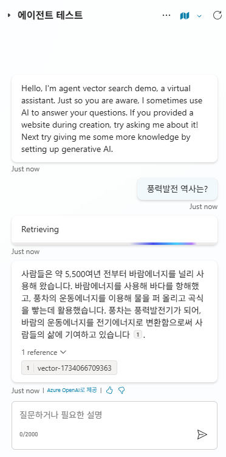

### 토픽 YAML 코드 예시

참고 `풍력발전` 토픽의 yaml 코드

```yaml
kind: AdaptiveDialog
modelDescription: 풍력발전의 역사, 소음, 필요 부지에 대한 답
beginDialog:
kind: OnRecognizedIntent
id: main
intent: {}
actions:
    - kind: SearchAndSummarizeContent
    id: Cypahn
    userInput: =System.Activity.Text
    additionalInstructions: |-
        너는 풍력발전에 대한 질문에 답을 할수 있다.
        
        \# 제약사항
        답변은 반드시 한국어로만 해야한다.
    fileSearchDataSource:
        searchFilesMode:
        kind: DoNotSearchFiles

    knowledgeSources:
        kind: SearchSpecificKnowledgeSources
        knowledgeSources:
        - cr687_agentVectorSearchDemo.knowledge.agentvectorsearchdemoAzureAI_rY18gjJhBPlmdzJ8z08vA        
```

---

[← 메인으로 돌아가기](../README.md)
