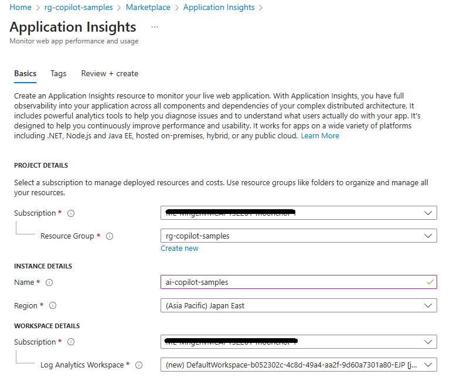
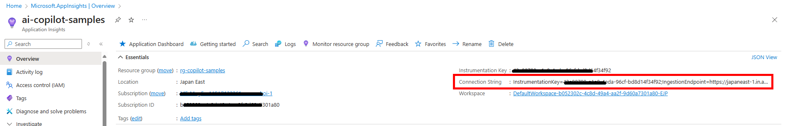
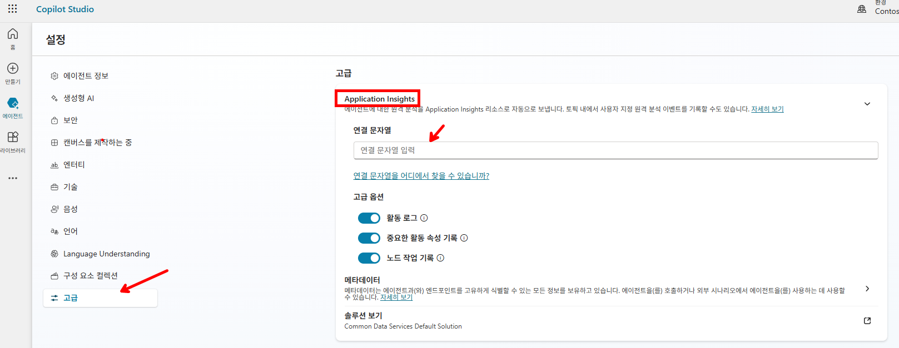
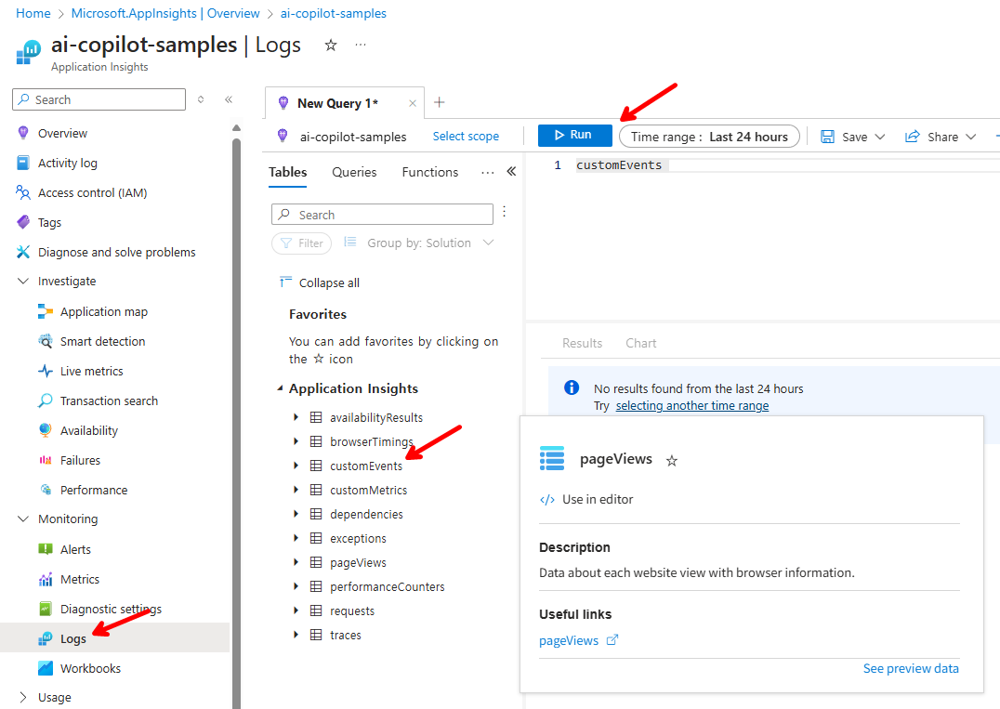
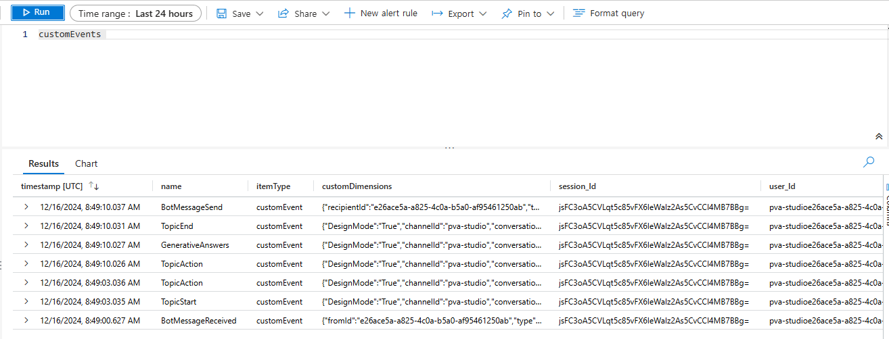
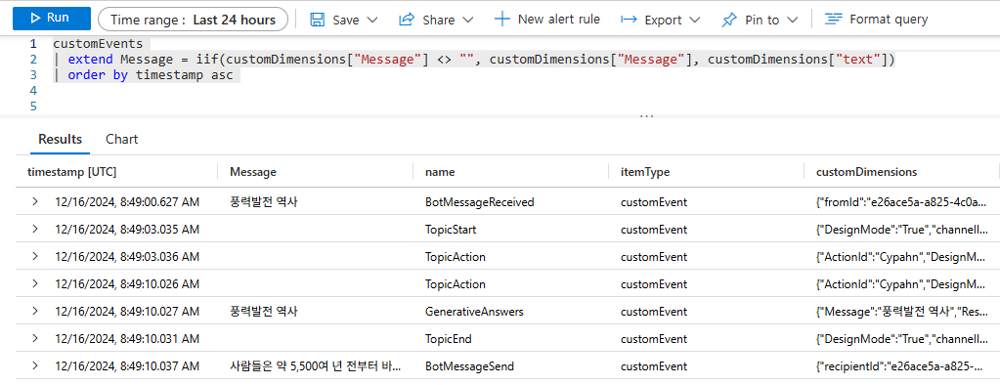

# 모니터링을 위한 APM 설정 방법 (Application Insights)

Application Insights를 활용하여 Copilot Studio의 대화 이력을 추적하고 모니터링하는 방법을 안내합니다.

---

## 1. Application Insights 리소스 생성

Application Insights 리소스 생성


- workspace 는 Log Analytics workspace 로써, 공용으로 사용해도 되며 생성된 리소스가 존재하지 않는 경우 새롭게 생성됩니다.

---

## 2. Connection String 복사

생성된 Application Insights 리소스의 `개요` 화면의 우측에 Connection String 을 복사



---

## 3. Copilot Studio 연결 설정

복사해둔 Connection String 을 Copilot Studio 의 [설정]-[고급] 화면에서 Application Insights 를 선택하고 `연결 문자열`에 붙여 넣습니다. 연결까지 약 5분 소요.



---

## 4. 테스트

연결한 Copilot Studio 에서 질문을 하여 테스트를 진행(약 5분 뒤에 로그가 application insights 로 저장)

---

## 5. 로그 조회

Azure Application Insights 의 [Monitoring]-[Log] 에서 `customEvents` 테이블을 더블클릭 하면 쿼리 편집기에 추가가 되며 `Run` 버튼을 클릭하여 실행



---

## 6. 로그 확인

다음처럼 로그가 보임



---

## 7. Kusto 쿼리를 통한 데이터 조회

다음과 같이 Kusto 쿼리를 통해서 필요한 데이터 조회

```kql
customEvents 
| extend Message = iif(customDimensions["Message"] <> "", customDimensions["Message"], customDimensions["text"])
| order by timestamp asc     
```



---

[← 메인으로 돌아가기](../README.md)
