# SharePoint 목록 조회하기

SharePoint 목록은 Copilot Studio의 기본 동작으로는 조회되지 않습니다. 이 가이드에서는 두 가지 방법을 소개합니다:
1. Power Automate를 이용한 방법
2. Dataverse Table을 이용한 방법

## 방법 1: Power Automate 이용

### 1. 준비사항

목록이 검색을 위해서 Power Automate 로 호출을 하기위해 다음과 같이 `자산관리` 목록에 데이터가 있다고 가정하고


### 2. 토픽 추가

토픽추가에서 트리거 구문을 지정(생성형 AI 인 경우 능동형으로 작성)

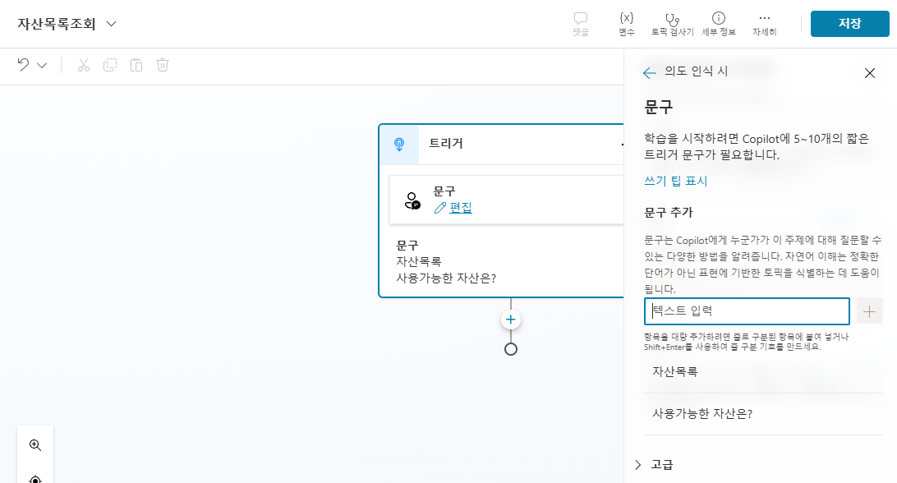

### 3. 작업호출 - 흐름 만들기

작업호출-흐름만들기 선택


### 4. Power Automate 흐름 생성

Power Automate 화면의 Copilot 프롬프트에 다음과 같이 입력하여 SharePoint 목록 조회하는 단계를 추가

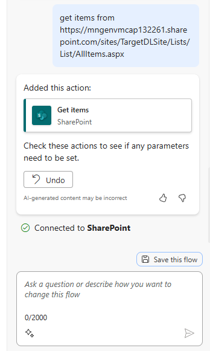
```
get items from https://mngenvmcap132261.sharepoint.com/sites/TargetDLSite/Lists/List/AllItems.aspx
```

### 5. SharePoint 목록 설정

Sharepoint 목록 확인 - 목록 이름으로 List Name 업데이트 및 Top count 지정

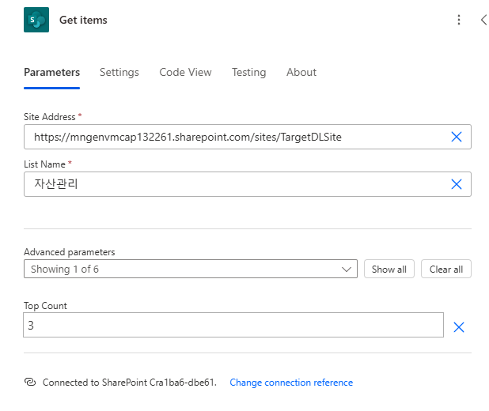

### 6. 변수 초기화

변수를 초기화


### 7. Apply to Each 설정

Apply to Each 추가 후 Append to string variable 에 Model 설정

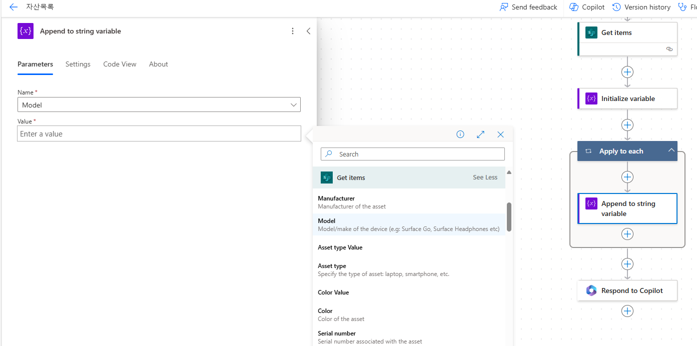

### 8. 출력 변수 지정

응답을 위한 출력변수 지정

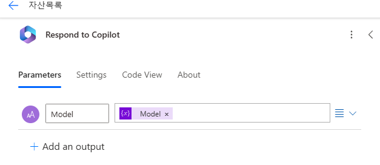

### 9. 테스트

Publish 후 Test 및 `Respond to Copilot` 을 클릭하여 테스트 결과 확인

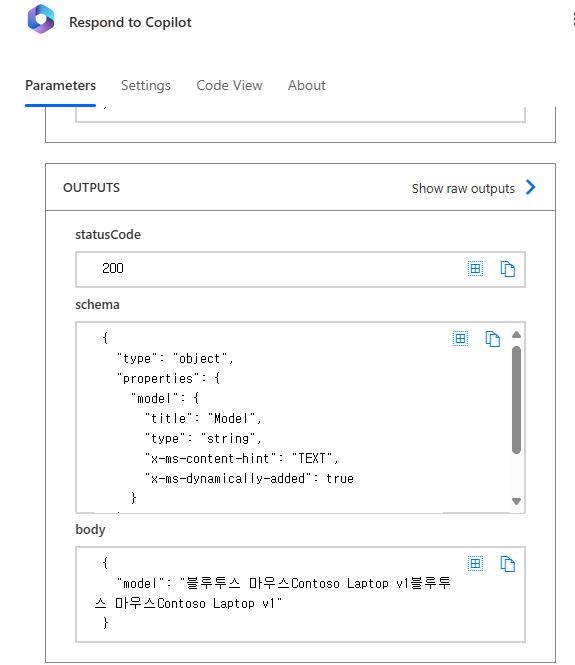

### 10. Copilot Studio에 Flow 추가

Copilot Studio 에서 잠시 기다린 후 작업호출을 클릭하면 추가된 Flow 보이므로 클릭하여 추가

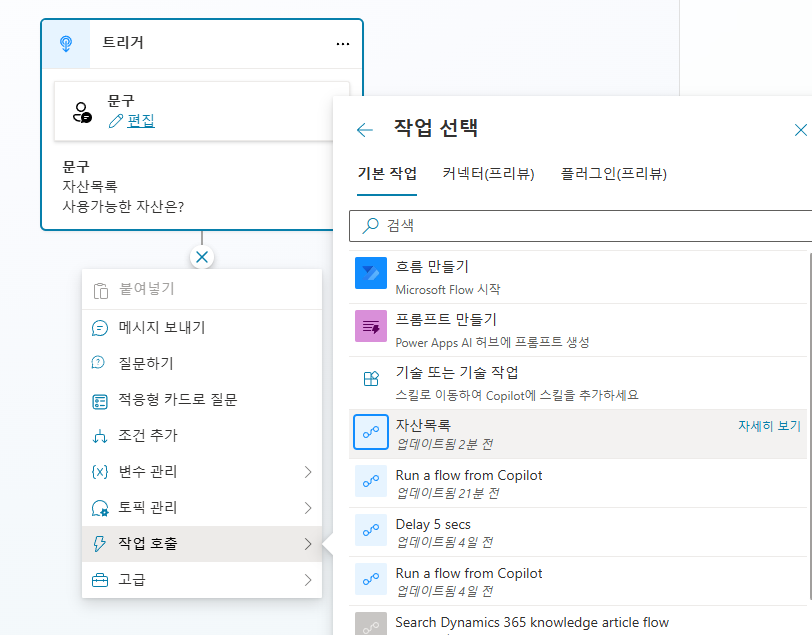

### 11. 메시지 보내기 설정

마지막 단계에서 `메시지 보내기` 선택하여 변수를 다음처럼 설정

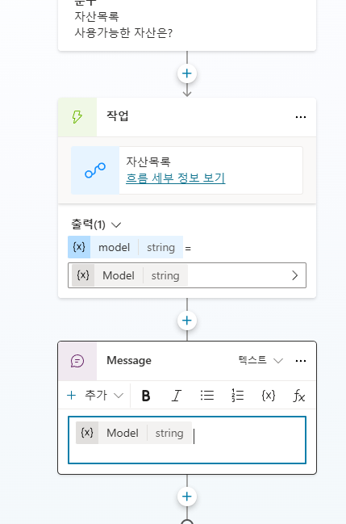

### 12. 연결 설정

다음처럼 연결 설정이 필요한 경우 연결을 클릭 하여 연결관리에서 연결해 주면 됨. 

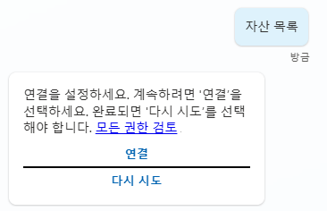


---

## 방법 2: Dataverse Table 이용

### 1. Dataverse Table 생성

[Power Apps](https://make.powerapps.com) 의 `테이블-SharePoint 목록으로 만들기` 선택


### 2. 목록 선택

목록을 선택하고 `다음`


### 3. 테이블 만들기

테이블의 이름을 확인한 후 `만들기` 선택

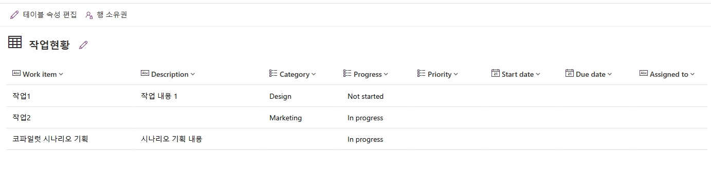

### 4. 테이블 열 확인

만들어진 테이블의 열(Column) 을 확인 하기 위해 `스키마-열` 선택하여 확인

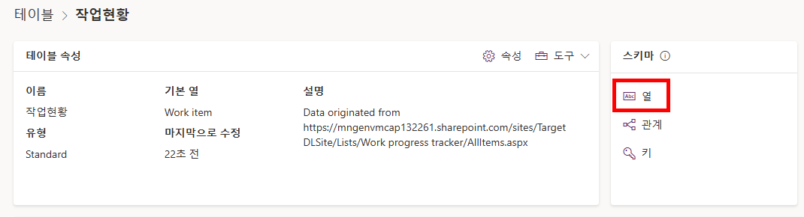

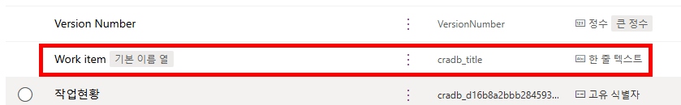

### 5. 참조자료 추가

Copilot Studio 에서 `참조자료` 추가

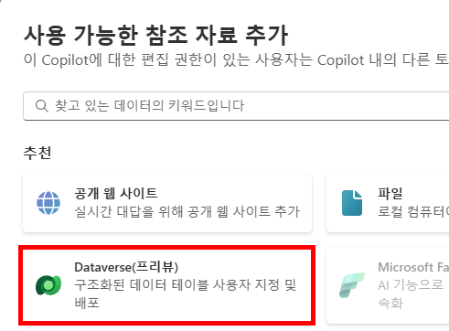

### 6. 테이블 선택

생성된 테이블 선택


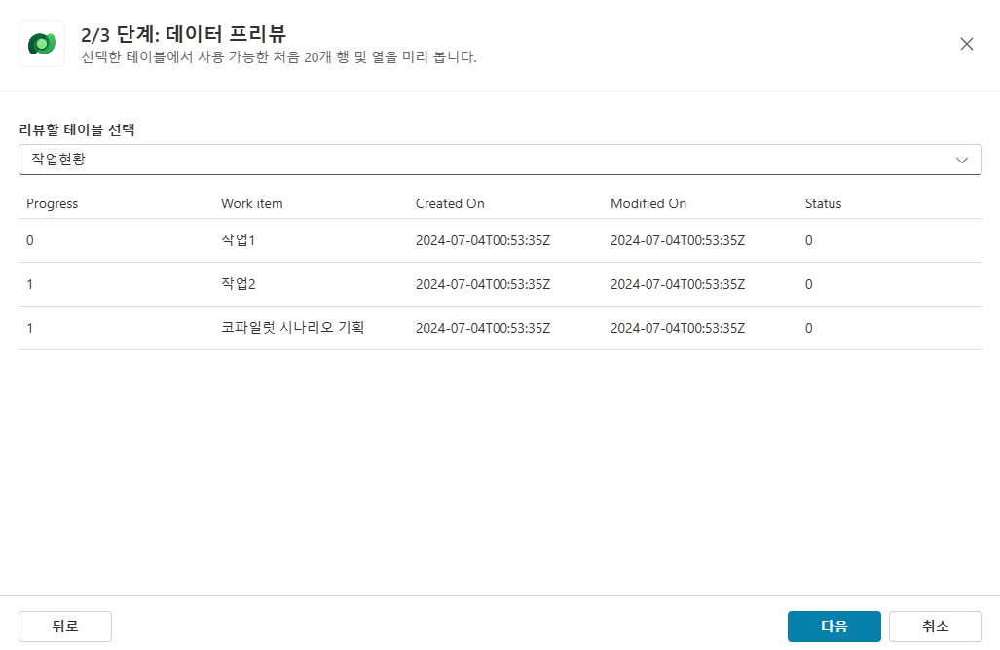

### 7. 동의어 추가 (옵션)

동의어 추가로 인식 향상 가능하지만 지금 단계에서는 생략

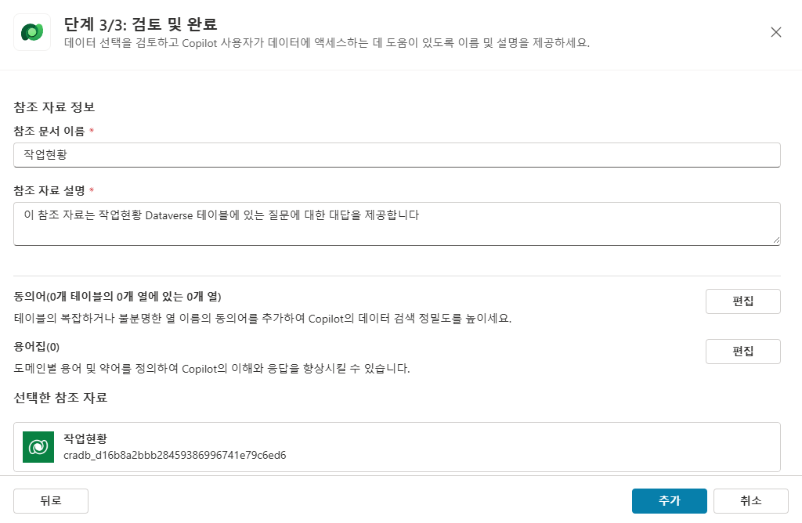

### 8. 토픽 생성

추가된 테이블 `작업현황`에 대해 조회를 하기위해 토픽 생성 후 테스트 목적이므로 트리거 문구를 `작업현황` 추가


### 9. Dataverse 작업 호출

`작업호출`을 선택하고 `dataverse` 키워드로 검색 후 `선택한 환경에서 행 나열` 선택


### 10. 입력값 설정

입력값에 환경 선택, 테이블 선택

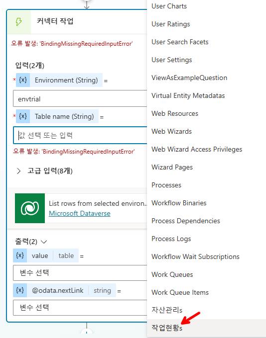

### 11. Select Columns 설정

4단계에서 확인한 열 이름을 고급 입력의 `Select Columns` 에 작성


### 12. 출력 변수 설정

출력에 변수를 설정


### 13. 메시지 보내기 - PowerFx 식 삽입

노드추가 `메시지 보내기` 선택하고 `PowerFx 식 삽입`을 클릭하여

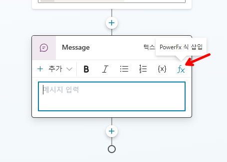

### 14. PowerFx 식 작성

다음처럼 `Concat(Topic.model, cradb_title & ", ")` 입력 후 토픽 저장


### 15. 연결 설정

테스트 시 연결이 필요한 경우 연결

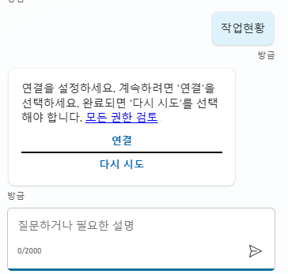

### 16. 테스트

연결 이후 다시 테스트 시 다음과 같이 Work Item 의 이름이 나열됨.


---

[← 메인으로 돌아가기](../README.md)
